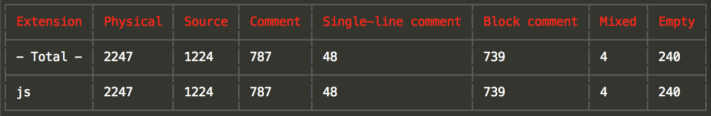

[![Build status][travis-image]][travis-url]
[![NPM version][npm-image]][npm-url]
[![Dependency Status][david-image]][david-url]
[![Downloads][downloads-image]][downloads-url]
[![License][license-image]][license-url]

<style></style>

## soi前端工程化工具



**s.o.i** 是一个前端项目构建打包构建工具, 内部集成了 [neo](https://github.com/AceMood/neo) 作为其资源扫描器, soi 相当于 neo 的后处理服务, 提供常见的打包插件, 如压缩、合并、文件指纹、CommonJS包装、less解析等等. 

## 流程


大致如流程图所示:

1. 
2.
3.
4.
5.

之所以说大致，是因为有一些细节和机制随时调整，比如编译缓存的实现。但于整体来说流程没有改变过，插件机制也没有改变过。

## 安装
确保本地安装了 node 安装包(大于v4.0.0版本), 通过包管理器 npm 进行安装. 

**注意**：

若安装过v0.14.0之前版本的 **soi**, 需要通过以下命令卸载依赖的 soi-cli

```
npm uninstall -g soi-cli
```
原因是老版本的 **soi** 绑定命令行执行是由 soi-cli 模块实现的, 而新版的 **soi** 内部就直接通过 package.json 的 bin 字段绑定了, 不再需要 soi-cli 模块. 

如第一次安装 **soi**, 或者之前没有安装过 soi-cli, 则直接运行以下脚本：

```
  npm install -g soi
```

安装新版本 **soi** 切记加 -g 全局安装标志, 这样可以在任意目录使用 **soi** 构建前端项目. 

接着安装 soi 依赖模块, 进入 soi 模块的安装目录, 运行

```
npm install
```

## 使用
在任意目录建立你的代码仓库, 开发完毕后在此目录添加配置文件：
```
  soi.conf.js
```
在 soi 的安装目录 samples 下会有示例项目, 分别对应 **soi release** 任务和 **soi deploy** 任务. 

**注意**：
资源扫描器在扫描目录的时候默认会跳过`_`开头的文件名, 在一些预处理插件中可以把诸如提供假数据的js文件或者抽想出来的变量、函数
的less文件名改成`_`开头, 在产出时不会产生空文件. 另一种做法是配置扫描器的ignorePaths属性或者插件的ignore属性(内置插件都
支持), 这个函数可以接受文件的工程路径作为参数, 返回true则表示忽略此资源. 

## 预处理器

soi 内部目前提供三种预处理器：

1.
2.
3.

## 插件机制

## 未来
**soi** 力求future proof, 包括其插件体系的实现. 分离编译工具为资源扫描和后处理服务插件正是为此. 灵感和启发来自于 Facebook 的 **Haste Internals**, 国内方面前辈有百度的 **F.I.S**. 

未实现的部分或者还不满意的部分[参见todo](./doc/todos.md), 其中最迫不及待就是对于html静态资源的扫描和基于ipc方式实现的编译缓存. 


[travis-image]: https://img.shields.io/travis/Saber-Team/soi.svg?style=flat-square
[travis-url]: https://travis-ci.org/Saber-Team/soi
[npm-image]: https://img.shields.io/npm/v/soi.svg?style=flat-square
[npm-url]: https://npmjs.org/package/soi
[node-image]: https://img.shields.io/node/v/soi.svg?style=flat-square
[node-url]: https://npmjs.org/package/soi
[david-image]: http://img.shields.io/david/Saber-Team/soi.svg?style=flat-square
[david-url]: https://david-dm.org/Saber-Team/soi
[coveralls-image]: https://img.shields.io/coveralls/Saber-Team/soi.svg?style=flat-square
[coveralls-url]: https://coveralls.io/r/Saber-Team/soi?branch=master
[downloads-image]: http://img.shields.io/npm/dm/soi.svg?style=flat-square
[downloads-url]: https://npmjs.org/package/soi
[license-image]: http://img.shields.io/npm/l/soi.svg?style=flat-square
[license-url]: LICENSE.md
